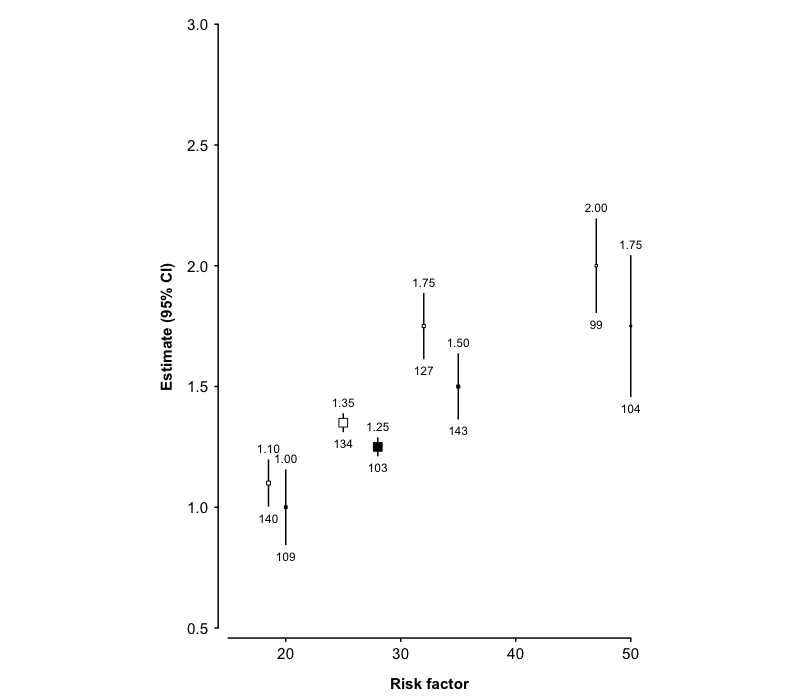
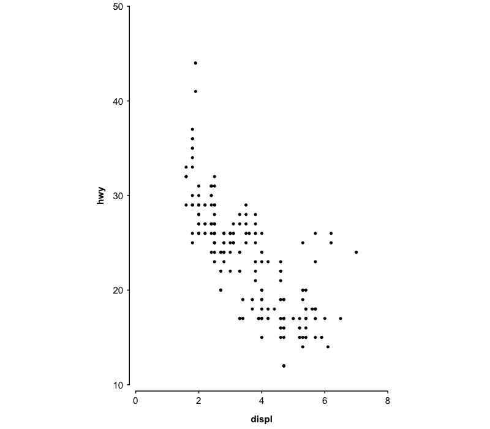
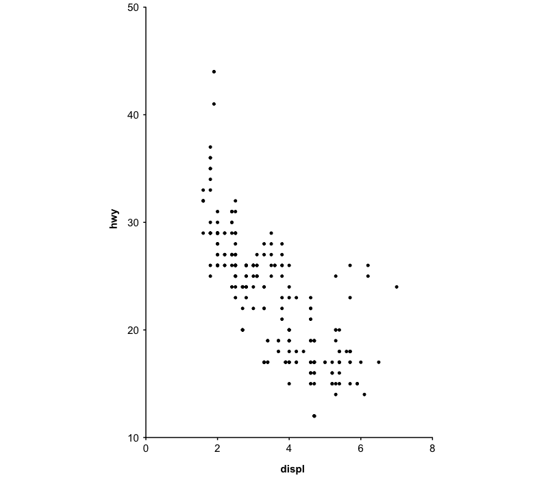
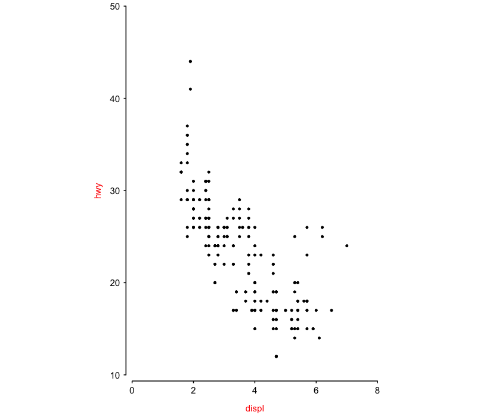
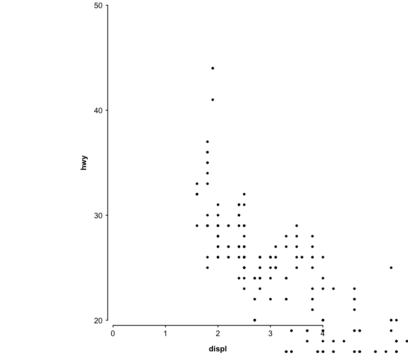
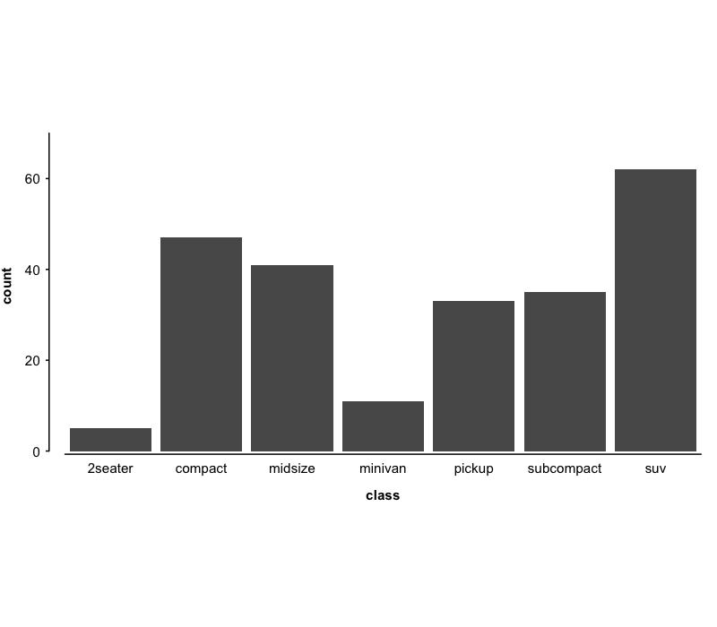
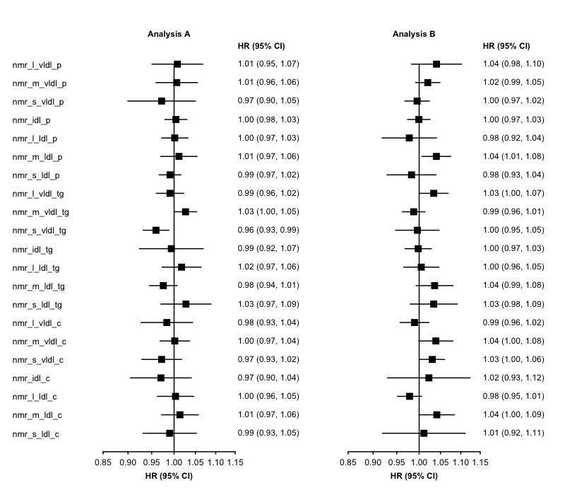
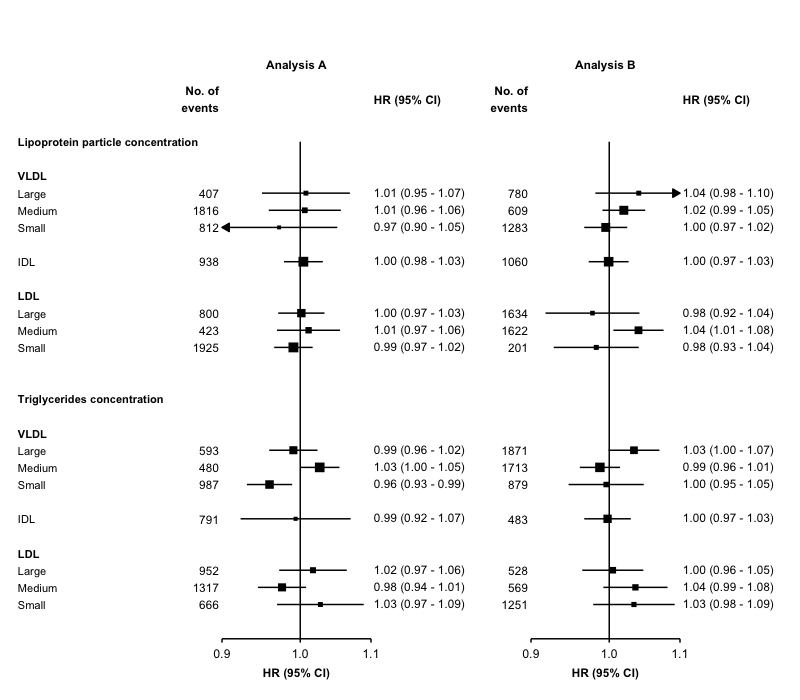

<!-- README.md is generated from README.Rmd. Please edit that file -->

# ckbplotr

`ckbplotr` provides functions to help create and style plots in R. It is
being developed by, and primarily for, [China Kadoorie
Biobank](http://www.ckbiobank.org) researchers.

## Installation

### Directly from github

The latest version of `ckbplotr` can be installed directly from github
using devtools.

``` r
install.packages('devtools')
devtools::install_github('neilstats/ckbplotr')
```

### Or from source package

`ckbplotr` can also be installed from its source package. The R packages
`ggplot2`, `magrittr`, `readr`, `tibble`, `dplyr`, `purrr` and `rlang`
must first be installed. These are part of the collection of tidyverse
packages.

``` r
# The easiest way is to install the whole tidyverse:
install.packages("tidyverse")

# # Or install just these packages:
# install.packages(c("ggplot2", "readr", "dplyr", "purrr"))
```

Then `ckbplotr` can be installed from its source package using the code:

``` r
install.packages("ckbplotr.tar.gz", repos = NULL, type = "source")
```

Or, in RStudio, open the “Tools” menu and select “Install Packages…”. In
the “Install from…” box select “Package Archive File”, and in the
“Package archive” box browse to the ckbplotr.tar.gz file.

The source package for the latest release version is available
[here](https://github.com/neilstats/ckbplotr/releases/latest).

## The make\_shape\_plot function

The `make_shape_plot` function creates a plot of estimates and CIs
against risk factor levels using the `ggplot2` package.

The function returns a named list containing:

  - plot: the plot
  - code: ggplot2 code to generate the plot

The function uses the `plot_like_ckb` function to modify the theme and
control the look of the plot.

In RStudio, the ggplot2 code used to generate the plot will be shown in
the ‘Viewer’ pane. This code can be copied and further edited to adapt
the plot.

### Examples

Given a data frame of estimates and standard errors (to be plotted on
the y axis), and risk factor levels (to be plotted on the x axis), a
plot can be created.

``` r
library(ggplot2)
library(ckbplotr)

results <- data.frame(
  est = c(1, 1.25, 1.5, 1.75, 1.1, 1.35, 1.75, 2),
  se = c(0.08, 0.02, 0.07, 0.15, 0.05, 0.02, 0.07, 0.1),
  rf = c(20, 28, 35, 50, 18.5, 25, 32, 47),
  n = c(109, 103, 143, 104, 140, 134, 127, 99),
  is_female = c(0, 0, 0, 0, 1, 1, 1, 1)
)

plot <- make_shape_plot(results[results$is_female == 1,],
                        col.x        = "rf",
                        col.estimate = "est",
                        col.stderr   = "se",
                        col.n        = "n",
                        xlims        = c(15,50),
                        ylims        = c(0.5, 3),
                        scalepoints  = TRUE,
                        title        = NULL)
```


The `col.group` argument can be supplied to plot results for different
groups (in shades of grey).

``` r
plot <- make_shape_plot(results,
                        col.x        = "rf",
                        col.estimate = "est",
                        col.stderr   = "se",
                        col.n        = "n",
                        col.group    = "is_female",
                        xlims        = c(15,50),
                        ylims        = c(0.5, 3),
                        scalepoints  = TRUE,
                        title        = NULL,
                        ciunder      = TRUE)
```



## The plot\_like\_ckb function

The `plot_like_ckb` function does three things to a ggplot2 plot:

1.  applies a CKB theme (i.e. change the overall appearance)
2.  extends the plotting area and manually adds axis lines (so that you
    can have a custom sized gap between the plotting area and the axes)
3.  applies a fixed aspect ratio

### Examples

Make a scatter plot with `ggplot`.

``` r
library(ggplot2)
library(ckbplotr)

plot <- ggplot(data = mpg, aes(x = displ, y = hwy)) + geom_point(size = 1)
plot
```


Then apply the `plot_like_ckb` function to the plot.

``` r
plot_like_ckb(plot = plot, xlims = c(0, 8), ylims = c(10, 50))
```



If you do not want a gap between the axes, set `gap = c(0, 0)`.

``` r
plot_like_ckb(plot = plot, xlims = c(0, 8), ylims = c(10, 50), gap = c(0, 0))
```



If you wish to override some aspect of the theme applied by
`plot_like_ckb`, then this can be done by adding a theme after the
function.

``` r
plot_like_ckb(plot = plot, xlims = c(0, 8), ylims = c(10, 50)) +
  theme(axis.title = element_text(colour = "red", face = "plain"))
```



If any data points you are plotting fall outside the axes, then they
will still be drawn and may show up in places such as the axes, the
legend, the plot title, or the plot margins. There is also no warning if
data points fall outside the whole plot area.

So it is best to check that your `xlim` and `ylim` values are suitable
for your data before using the function.

``` r
# The xlim and ylim ranges are too narrow
plot_like_ckb(plot = plot, xlims = c(0, 4), ylims = c(20, 50))
```



A bar chart.

``` r
barplot <- ggplot(mpg, aes(class)) + geom_bar()
plot_like_ckb(barplot, xlims = c(0.5, 7.5), ylims = c(0, 70), gap = c(0.025, 0.005), ratio = 0.5) +
  theme(axis.ticks.x = element_blank())
```



## The make\_forest\_plot function

The `make_forest_plot` function creates a forest plot using the
`ggplot2` graphics package. It is available as part of the `ckbplotr`
package.

The function returns a named list containg:

  - plot: the plot
  - data: a data frame from which the plot is generated
  - code: ggplot2 code to generate the plot

In RStudio the ggplot2 code used to generate the plot will be shown in
the ‘Viewer’ pane. If modifications are needed to the plot, then this
code can be copied, edited, and run as needed.

### Expected warning

You may get the following warning when using this function.

> Vectorized input to `element_text()` is not officially supported.
> Results may be unexpected or may change in future versions of ggplot2.

This is related to how some headings used to label the rows of the
forest plot are made bold. This should not be a problem if the forest
plot produced appears as expected. (This hack is discussed
[here](https://github.com/tidyverse/ggplot2/issues/3492).)

### The headings data frame

The data frame specified in the `headings` argument allows the use of
headings to label the rows of the forest plot.

This must data frame contain columns ‘heading1’, ‘heading2’ and
‘heading3’, which can be set to NA if not needed for a particular row.
For example, if you do not need a third level of heading for a
particular row, then set `heading3=NA` for that row. If you only need
one level of headings, then set `heading2=NA` and `heading3=NA` for
every row.

The data set must also contain a column with the same name as a column
in each of the results data sets. This column is used to match headings
to the correct results, and is specified in the argument `col.key`.

The argument `rows` specifies which results should be included in the
plot, by giving some headings from the heading1 column of the headings
data frame.

(The order given in the `rows` argument decides the order in which the
heading1 labels will be in the plot (top to bottom). The heading2 and
heading3 labels will be in the order that they are in the headings data
frame.)

### Examples

First of all, do your analyses and put the results into data frames (one
data frame for each forest plot column). Here we generate some example
results.

``` r
set.seed(57911624)
exampleresults <- function(){
  data.frame(variable = c('nmr_l_vldl_p', 'nmr_m_vldl_p', 'nmr_s_vldl_p',
                          'nmr_idl_p',
                          'nmr_l_ldl_p', 'nmr_m_ldl_p', 'nmr_s_ldl_p',
                          'nmr_l_vldl_tg', 'nmr_m_vldl_tg', 'nmr_s_vldl_tg',
                          'nmr_idl_tg',
                          'nmr_l_ldl_tg', 'nmr_m_ldl_tg', 'nmr_s_ldl_tg',
                          'nmr_l_vldl_c', 'nmr_m_vldl_c', 'nmr_s_vldl_c',
                          'nmr_idl_c',
                          'nmr_l_ldl_c', 'nmr_m_ldl_c', 'nmr_s_ldl_c'),
             estimate = rnorm(21, 0, 0.02),
             stderr   = 0.012 + abs(rnorm(21, 0, 0.015)),
             n        = round(runif(21, 100, 2000)),
             nb       = round(runif(21, 100, 2000)))
}
resultsA <- exampleresults()
resultsB <- exampleresults()
resultsC <- exampleresults()
resultsD <- exampleresults()
resultsE <- exampleresults()
```

``` r
library(ckbplotr)

forestplot <- make_forest_plot(cols         = list(resultsA, resultsB),
                               exponentiate = TRUE,
                               colnames     = c("Analysis A", "Analysis B"),
                               col.key      = "variable")
#> Warning: Vectorized input to `element_text()` is not officially supported.
#> Results may be unexpected or may change in future versions of ggplot2.
```



To use headings, create a data frame of headings and specify arguments
`headings` and `rows`.

    #>                              heading1 heading2 heading3      variable
    #> 1  Lipoprotein particle concentration     VLDL    Large  nmr_l_vldl_p
    #> 2  Lipoprotein particle concentration     VLDL   Medium  nmr_m_vldl_p
    #> 3  Lipoprotein particle concentration     VLDL    Small  nmr_s_vldl_p
    #> 4  Lipoprotein particle concentration      IDL     <NA>     nmr_idl_p
    #> 5  Lipoprotein particle concentration      LDL    Large   nmr_l_ldl_p
    #> 6  Lipoprotein particle concentration      LDL   Medium   nmr_m_ldl_p
    #> 7  Lipoprotein particle concentration      LDL    Small   nmr_s_ldl_p
    #> 8         Triglycerides concentration     VLDL    Large nmr_l_vldl_tg
    #> 9         Triglycerides concentration     VLDL   Medium nmr_m_vldl_tg
    #> 10        Triglycerides concentration     VLDL    Small nmr_s_vldl_tg
    #> 11        Triglycerides concentration      IDL     <NA>    nmr_idl_tg
    #> 12        Triglycerides concentration      LDL    Large  nmr_l_ldl_tg
    #> 13        Triglycerides concentration      LDL   Medium  nmr_m_ldl_tg
    #> 14        Triglycerides concentration      LDL    Small  nmr_s_ldl_tg
    #> 15          Cholesterol concentration     VLDL    Large  nmr_l_vldl_c
    #> 16          Cholesterol concentration     VLDL   Medium  nmr_m_vldl_c
    #> 17          Cholesterol concentration     VLDL    Small  nmr_s_vldl_c
    #> 18          Cholesterol concentration      IDL     <NA>     nmr_idl_c
    #> 19          Cholesterol concentration      LDL    Large   nmr_l_ldl_c
    #> 20          Cholesterol concentration      LDL   Medium   nmr_m_ldl_c
    #> 21          Cholesterol concentration      LDL    Small   nmr_s_ldl_c

``` r
forestplot <- make_forest_plot(headings         = headings,
                               rows             = c("Lipoprotein particle concentration",
                                                    "Triglycerides concentration"),
                               cols             = list(resultsA, resultsB),
                               exponentiate     = TRUE,
                               colnames         = c("Analysis A", "Analysis B"),
                               col.key          = "variable",
                               ci.delim         = " - ",
                               xlim             = c(0.9, 1.1),
                               xticks           = c(0.9, 1, 1.1),
                               blankrows        = c(1, 1, 0, 1),
                               scalepoints      = TRUE,
                               pointsize        = 3,
                               col.left         = c("n"),
                               col.left.space   = c(0.02),
                               col.left.heading = c("No. of\nevents"),
                               col.right.space  = 0.02,
                               col.heading.space = 1.5,
                               heading.space    = 2,
                               plot.space       = 8)
#> Warning: Vectorized input to `element_text()` is not officially supported.
#> Results may be unexpected or may change in future versions of ggplot2.
```



## make\_jasper\_forest\_plot function

The `make_jasper_forest_plot` function requires the in-house Jasper
package, which is not publicly available.
