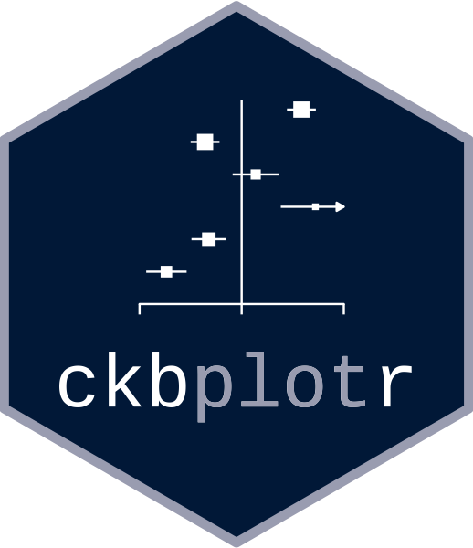
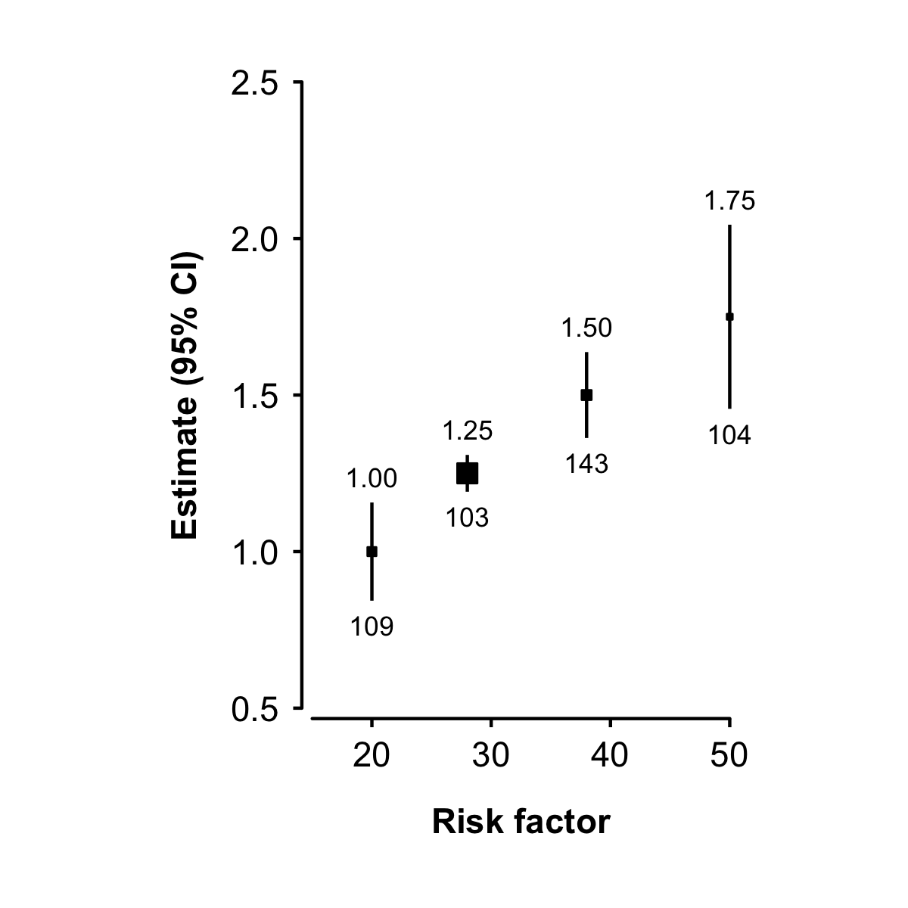

<!-- README.md is generated from README.Rmd. Please edit that file -->

# ckbplotr 

<!-- badges: start -->

[](https://github.com/neilstats/ckbplotr/actions)
[](https://codecov.io/gh/neilstats/ckbplotr?branch=main)
<!-- badges: end -->

`ckbplotr` provides functions to help create and style plots in R. It is
being developed by, and primarily for, [China Kadoorie
Biobank](http://www.ckbiobank.org) researchers.

*This package is under development. If you find an error or bug or have
a suggestion for improvement please create an issue on GitHub or contact
the author at <neil.wright@ndph.ox.ac.uk> or
[@NeilStats](https://twitter.com/NeilStats).*

It can be used to: create plots of estimates and CIs against risk factor
levels…


…create forest plots…


…and convert other ggplots to CKB style.


## Installation

### Directly from github

The latest version of `ckbplotr` can be installed directly from github
using the `remotes` package.

``` r
install.packages('remotes')
remotes::install_github('neilstats/ckbplotr')
```

If you get an error that reads “Error: Failed to install ‘unknown
package’ from GitHub: HTTP error 404. No commit found for the ref
master” then make sure to update to the latest version of the `remotes`
package, or try `remotes::install_github('neilstats/ckbplotr@main')`.

If you get an error that reads “Error: (converted from warning) package
‘ggplot2’ was built under R version …” you can avoid this by first
running `Sys.setenv("R_REMOTES_NO_ERRORS_FROM_WARNINGS" = "true")`.
(This is a [known issue](https://github.com/r-lib/remotes/issues/403)
with the `remotes` package.)

### Or from source package

`ckbplotr` can also be installed from its source package. The R packages
`ggplot2`, `magrittr`, `readr`, `tibble`, `dplyr`, `purrr`, `rlang`, and
`ggtext` must first be installed.

``` r
# The easiest way is to install the whole tidyverse and ggtext:
install.packages("tidyverse", "ggtext")

# # Or install just these packages:
# install.packages(c("ggplot2", "readr", "dplyr", "purrr", "ggtext"))
```

Then `ckbplotr` can be installed from its source package using the code:

``` r
install.packages("ckbplotr.tar.gz", repos = NULL, type = "source")
```

Or, in RStudio, open the “Tools” menu and select “Install Packages…”. In
the “Install from…” box select “Package Archive File”, and in the
“Package archive” box browse to the ckbplotr.tar.gz file.

The source package for the latest release version is available
[here](https://github.com/neilstats/ckbplotr/releases/latest).

## Get started

Go to [“Get started with ckbplotr”](articles/ckbplotr.html) to see how
to use the `make_shape_plot()`, `make_forest_plot()`, and
`plot_like_ckb()` functions.

## ggplot2 code

The `make_shape_plot()` and `make_forest_plot()` functions return both a
plot and the ggplot2 code used to create the plot. In RStudio the
ggplot2 code used to create the plot will be shown in the Viewer pane
(with syntax highlighting if the
[highlights](https://cran.r-project.org/package=highlight) package is
installed).
