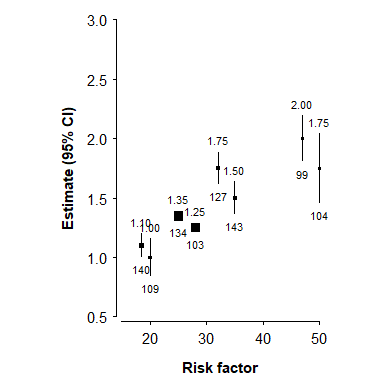
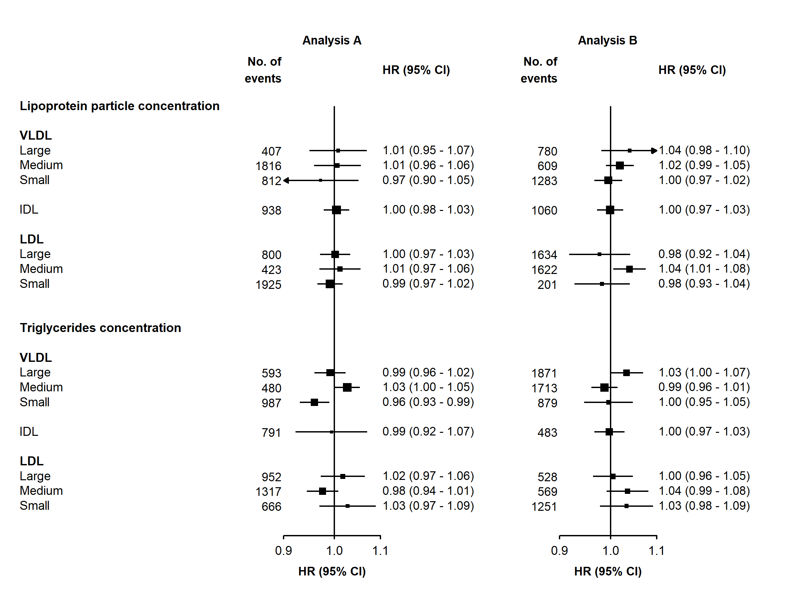
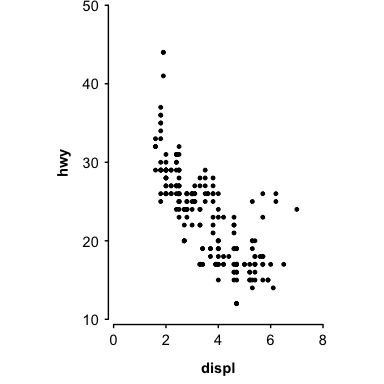

<!-- README.md is generated from README.Rmd. Please edit that file -->

# ckbplotr

<!-- badges: start -->

[](https://github.com/neilstats/ckbplotr/actions)
[](https://codecov.io/gh/neilstats/ckbplotr?branch=master)
<!-- badges: end -->

`ckbplotr` provides functions to help create and style plots in R. It is
being developed by, and primarily for, [China Kadoorie
Biobank](http://www.ckbiobank.org) researchers.

## Installation

### Directly from github

The latest version of `ckbplotr` can be installed directly from github
using the `remotes` package.

``` r
install.packages('remotes')
remotes::install_github('neilstats/ckbplotr')
```

If you get an error that reads “Error: Failed to install ‘unknown
package’ from GitHub: HTTP error 404. No commit found for the ref
master” then make sure to update to the latest version of the `remotes`
package, or try `remotes::install_github('neilstats/ckbplotr@main')`.

If you get an error that reads “Error: (converted from warning) package
‘ggplot2’ was built under R version …” you can avoid this by first
running `Sys.setenv("R_REMOTES_NO_ERRORS_FROM_WARNINGS" = "true")`.
(This is a [known issue](https://github.com/r-lib/remotes/issues/403)
with the `remotes` package.)

### Or from source package

`ckbplotr` can also be installed from its source package. The R packages
`ggplot2`, `magrittr`, `readr`, `tibble`, `dplyr`, `purrr`, `rlang`, and
`ggtext` must first be installed.

``` r
# The easiest way is to install the whole tidyverse and ggtext:
install.packages("tidyverse", "ggtext")

# # Or install just these packages:
# install.packages(c("ggplot2", "readr", "dplyr", "purrr", "ggtext"))
```

Then `ckbplotr` can be installed from its source package using the code:

``` r
install.packages("ckbplotr.tar.gz", repos = NULL, type = "source")
```

Or, in RStudio, open the “Tools” menu and select “Install Packages…”. In
the “Install from…” box select “Package Archive File”, and in the
“Package archive” box browse to the ckbplotr.tar.gz file.

The source package for the latest release version is available
[here](https://github.com/neilstats/ckbplotr/releases/latest).

## Shape plots

`make_shape_plot()` creates a plot of estimates and CIs against risk
factor levels using the [ggplot2](https://ggplot2.tidyverse.org/)
graphics package. The function returns both a plot and the ggplot2 code
used to create the plot. In RStudio the ggplot2 code used to create the
plot will be shown in the Viewer pane (with syntax highlighting if the
[highlights](https://cran.r-project.org/package=highlight) package is
installed).



## Forest plots

`make_forest_plot()` creates a forest plot using the
[ggplot2](https://ggplot2.tidyverse.org/) graphics package. The function
returns both a plot and the ggplot2 code used to create the plot. In
RStudio the code used to create the plot will be shown in the Viewer
pane (with syntax highlighting if the
[highlights](https://cran.r-project.org/package=highlight) package is
installed).



#### make\_jasper\_forest\_plot function

`make_jasper_forest_plot()` requires the in-house Jasper package, which
is not publicly available.

## Other plots

`plot_like_ckb()` does three things to a
[ggplot2](https://ggplot2.tidyverse.org/) plot:

1.  applies a CKB theme (i.e. change the overall appearance)
2.  extends the plotting area and manually adds axis lines (so that you
    can have a custom sized gap between the plotting area and the axes)
3.  applies a fixed aspect ratio


