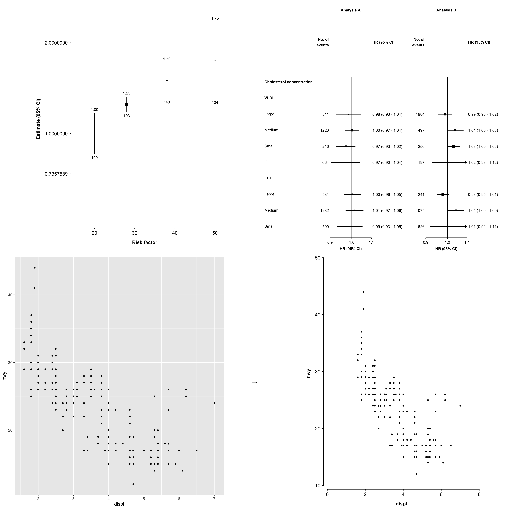

<!-- README.md is generated from README.Rmd. Please edit that file -->

# ckbplotr 

<!-- badges: start -->

[](https://github.com/neilstats/ckbplotr/actions)
[](https://codecov.io/gh/neilstats/ckbplotr?branch=main)
[](https://zenodo.org/badge/latestdoi/189028664)
<!-- badges: end -->

`ckbplotr` provides functions to help create and style plots in R. It is
being developed by, and primarily for, [China Kadoorie
Biobank](http://www.ckbiobank.org) researchers.

*This package is under development. If you find an error or bug or have
a suggestion for improvement please create an issue on GitHub or contact
the author at <neil.wright@ndph.ox.ac.uk>,
[@NeilStats](https://twitter.com/NeilStats), or
[@NeilStats@fediscience.org](https://fediscience.org/@neilstats).*

It can be used to: create plots of estimates and CIs against risk factor
levels…


…create forest plots…


…and convert other ggplots to CKB style.


## Key features

Functions that create plots (such as `shape_plot()` and `forest_plot()`)
return both:

- A **ggplot2 plot**. This allows users to further manipulate the plot
  using ggplot2 code, such as `+ theme()` to customise the plot.
- The **ggplot2 code used to create the plot**. This allows uses to see
  exactly how the plot has been created, and adapt the code for other
  uses. (In RStudio the code will also be shown in the Viewer pane.)

## Installation

### From R-universe

The latest version of `ckbplotr` can be installed from the neilstats
R-universe using `install.packages()`.

``` r
install.packages('ckbplotr',
                 repos = c('https://neilstats.r-universe.dev', 'https://cloud.r-project.org'))
```

This will also install dependencies from the CRAN repository.

### From github

The latest version of `ckbplotr` can also be installed from github using
the `remotes` package.

``` r
install.packages('remotes')
remotes::install_github('neilstats/ckbplotr')
```

## Get started

Read `vignette("ckbplotr")` to see how to use the `shape_plot()`,
`forest_plot()`, and `plot_like_ckb()` functions.
