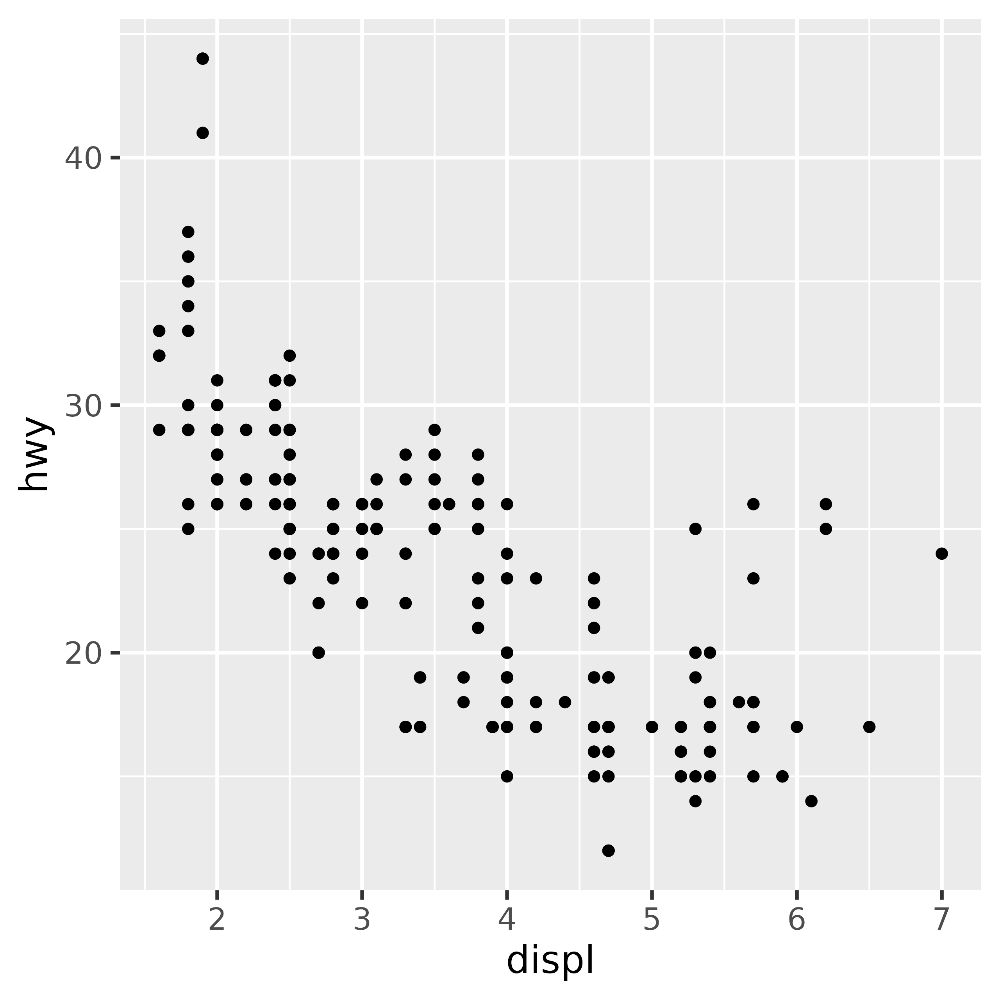
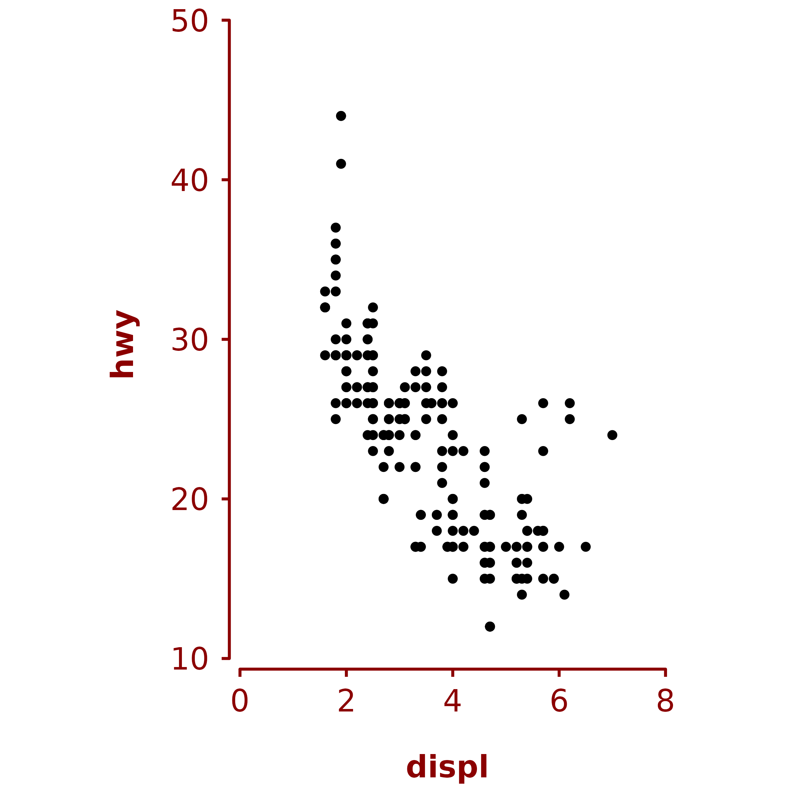

# CKB style with ggplot

`+ ckb_style()` does three things to a ggplot2 plot:

1.  applies a CKB theme (i.e. change the overall appearance)
2.  extends the plotting area and caps the axis lines (so that you can
    have a custom sized gap between the plotting area and the axes)
3.  applies a fixed aspect ratio

## Examples with a scatter plot

Make a scatter plot with `ggplot`.

``` r
plot <- ggplot(data = mpg, aes(x = displ, y = hwy)) + geom_point(size = 1)
plot
```



Use `+ ckb_style()` to apply a CKB theme, cap axis lines and fix the
aspect ratio.

``` r
plot + ckb_style()
```


Or apply just a CKB theme.

``` r
plot + theme_ckb()
```


### Axis limits

Set axis limits.

``` r
plot + ckb_style(xlims = c(0, 8), ylims = c(10, 50))
```


If you do not want a gap between the axes, set `gap = c(0, 0)`.

``` r
plot + ckb_style(xlims = c(0, 8), ylims = c(10, 50), gap = c(0, 0))
```


### Aspect ratio and panel sizes

Change the aspect ratio of the plot.

``` r
plot + ckb_style(xlims = c(0, 8),
                 ylims = c(10, 50),
                 ratio = 0.3)
```


Set the width of the plot (`width` controls the length of the x axis).

``` r
plot + ckb_style(xlims = c(0, 8),
                 ylims = c(10, 50),
                 ratio = 1.5,
                 width = unit(4, "cm"))
```


### Modifying the appearance of the plot

The `ink` and `paper` arguments of
[`theme_ckb()`](https://neilstats.github.io/ckbplotr/reference/theme_ckb.md)
and
[`ckb_style()`](https://neilstats.github.io/ckbplotr/reference/ckb_style.md)
can be used to change the colours of the plot.

``` r
plot + ckb_style(xlims = c(0, 8),
                 ylims = c(10, 50),
                 ink = "darkred",
                 paper = "cornsilk")
```



The `plot.margin` arguments of
[`theme_ckb()`](https://neilstats.github.io/ckbplotr/reference/theme_ckb.md)
and
[`ckb_style()`](https://neilstats.github.io/ckbplotr/reference/ckb_style.md)
can be used to adjust the margin around the plot.

``` r
plot + ckb_style(xlims = c(0, 8),
                 ylims = c(10, 50),
                 plot.margin = margin(2, 2, 2, 2, unit = "cm"))
```


If you wish to override some aspect of the theme applied by
[`ckb_style()`](https://neilstats.github.io/ckbplotr/reference/ckb_style.md)
or
[`theme_ckb()`](https://neilstats.github.io/ckbplotr/reference/theme_ckb.md),
then this can be done by adding a theme after `+ ckb_style()`,

``` r
plot + ckb_style(xlims = c(0, 8),
                 ylims = c(10, 50)) +
  theme(axis.title = element_text(colour = "red", face = "plain"))
```


### Data points outside axis limits

There is no warning if data points fall outside the axis limits. So
check that your `xlim` and `ylim` values are suitable for your data
before using the function.

``` r
# The xlim and ylim ranges are too narrow
plot + ckb_style(xlims = c(0, 4), ylims = c(20, 50))
```


## Bar chart example

``` r
ggplot(mpg, aes(class)) + 
  geom_bar() +
  ckb_style(xlims = c(0.5, 7.5),
            ylims = c(0, 70),
            gap = c(0.025, 0.005),
            ratio = 0.5) +
  theme(axis.ticks.x = element_blank())
```


