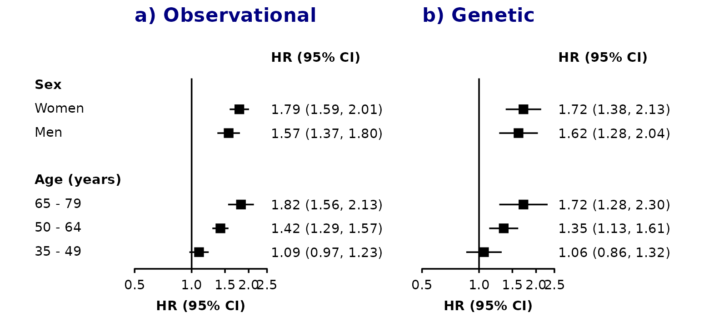

# Customising plots

## Arguments

In
[`shape_plot()`](https://neilstats.github.io/ckbplotr/reference/shape_plot.md)
and
[`forest_plot()`](https://neilstats.github.io/ckbplotr/reference/forest_plot.md)
use `base_size` to set the base font and line size (default: 11pts) and
use `base_line_size` to separately set the base thickness of lines
(default: base_size/22).

In
[`forest_plot()`](https://neilstats.github.io/ckbplotr/reference/forest_plot.md)
use `plotcolour` to change the colour for all parts of the plot. In
[`shape_plot()`](https://neilstats.github.io/ckbplotr/reference/shape_plot.md)
use `plotcolour` to change the colour for non-data aspects of the plot.

In
[`shape_plot()`](https://neilstats.github.io/ckbplotr/reference/shape_plot.md)
and
[`forest_plot()`](https://neilstats.github.io/ckbplotr/reference/forest_plot.md)
several arguments can be used to change visual properties for parts of
the plot. These can be names of columns in your data or single values.
In
[`shape_plot()`](https://neilstats.github.io/ckbplotr/reference/shape_plot.md)
use:

| argument | controls                                          | type      |
|----------|---------------------------------------------------|-----------|
| shape    | plotting character for points                     | integer   |
| colour   | colour of points                                  | character |
| cicolour | colour of CI lines                                | character |
| fill     | fill colour of points                             | character |
| ciunder  | if the CI line should be plotted before the point | logical   |

In
[`forest_plot()`](https://neilstats.github.io/ckbplotr/reference/forest_plot.md)
use:

| argument    | controls                                          | type      |
|-------------|---------------------------------------------------|-----------|
| shape       | plotting character for points                     | integer   |
| colour      | colour of points and lines                        | character |
| fill        | fill colour of points                             | character |
| ciunder     | if the CI line should be plotted before the point | logical   |
| col.bold    | if text is bold                                   | logical   |
| col.diamond | if a diamond should be plotted                    | logical   |

Note that `col.bold`, and `col.diamond` must be column names in the
supplied data frames, while the others can be fixed values or column
names. For diamonds, alternatively provide a character vector of keys in
the `diamond` argument.

For `fill` to have any effect, the shape will need to be a shape with
fill e.g. `"square filled"`.

## Adding to the ggplot

In
[`forest_plot()`](https://neilstats.github.io/ckbplotr/reference/forest_plot.md)
and
[`shape_plot()`](https://neilstats.github.io/ckbplotr/reference/shape_plot.md)
you can add additional ggplot objects to the plot with the `add`
argument. The argument should be a named list, where the name `start` is
an object to be included in the ggplot immediately after `ggplot()`
(i.e. before anything else is added to the ggplot) and the name `end`
will add to the end.

This argument can be used, for example, to add additional geoms to the
plot:

``` r
hr_geom <- geom_text(aes(label = auto_estcolumn),
                     size = 3,
                     hjust = 0,
                     nudge_y = 0.25,
                     colour = "red")

forest_plot(my_results,
            estcolumn = FALSE,
            add = list(start = hr_geom))
```


Or to use `theme` to customise the plot:

``` r
my_theme <- theme(axis.text.x = element_text(colour = "purple",
                                             angle = 45,
                                             hjust = 1))
forest_plot(my_results,
            add = list(end = my_theme))
```


To add multiple objects, use a list:

``` r
my_parts <- list(hr_geom,
                 my_theme)
forest_plot(my_results,
            estcolumn = FALSE,
            add = list(end = my_parts))
```


## Adding aesthetics and arguments

The addaes and addarg arguments in
[`shape_plot()`](https://neilstats.github.io/ckbplotr/reference/shape_plot.md)
and
[`forest_plot()`](https://neilstats.github.io/ckbplotr/reference/forest_plot.md)
can be used to add additional aesthetics and arguments code to the
ggplot layers created by the functions. These arguments must be named
lists of character strings, and the names of elements defines where the
aesthetics/arguments code is added.

In
[`shape_plot()`](https://neilstats.github.io/ckbplotr/reference/shape_plot.md)
the following names will add aesthetics and arguments to layers:

| name             | layer that plots                      |
|------------------|---------------------------------------|
| lines            | lines of linear fit through estimates |
| estimates.points | point estimates                       |
| estimates.text   | text of estimates                     |
| n.text           | text of number of events (n)          |
| ci               | confidence intervals                  |
| theme            | theme                                 |

In
[`forest_plot()`](https://neilstats.github.io/ckbplotr/reference/forest_plot.md)
the following names will add aesthetics and arguments to layers:

| name                       | layer that plots                   |
|----------------------------|------------------------------------|
| ci                         | confidence intervals               |
| points                     | point estimates                    |
| diamonds                   | diamonds                           |
| col.right/col.left         | col.right/col.left columns         |
| heading.right/heading.left | col.right/col.left column headings |
| xlab                       | x-axis label                       |
| panel.headings             | headings above panels              |
| nullline                   | line at null                       |
| addtext                    | ‘addtext’ text                     |
| theme                      | theme                              |

Where duplicate aesthetics/arguments might be defined and created, they
are kept with the priority:

1.  Aesthetic arguments specified using addaes and addarg
2.  Aesthetic arguments created by the function
3.  Other arguments specified using addaes and addarg
4.  Other arguments created by the function

This can be used to ‘overwrite’ some of the code that would otherwise be
produced by
[`shape_plot()`](https://neilstats.github.io/ckbplotr/reference/shape_plot.md)
and
[`forest_plot()`](https://neilstats.github.io/ckbplotr/reference/forest_plot.md).

For example, adjusting the position and appearance of panel headings:

``` r
forest_plot(list("a) Observational" = my_resultsA,
                 "b) Genetic"       = my_resultsB),
            col.key    = "subgroup",
            row.labels = row_labels,
            addaes = list(panel.headings = "x = 0.5"),
            addarg = list(panel.headings = c("size = 4.5",
                                             "colour = 'navyblue'",
                                             "hjust = 0")))
```


Changing the appearance of the line at the ‘null’:

``` r
forest_plot(list("a) Observational" = my_resultsA,
                 "b) Genetic"       = my_resultsB),
            col.key    = "subgroup",
            row.labels = row_labels,
            addarg = list(nullline = c("linetype = 'dashed'",
                                       "colour = 'darkorange'")))
```



## Replacing parts of the plot

The `add` argument can also be used to replace parts of the plot.

In
[`shape_plot()`](https://neilstats.github.io/ckbplotr/reference/shape_plot.md)
the following names will replace parts of the plot:

| name             | what code is replaced                                  |
|------------------|--------------------------------------------------------|
| scale.x          | x-axis scale                                           |
| scale.y          | y-axis scale                                           |
| scale.radius     | scale for point size                                   |
| scale.shape      | scale for shape                                        |
| scale.colour     | scale for colour                                       |
| scale.fill       | scale for fill                                         |
| estimates.points | point estimates                                        |
| estimates.text   | estimates text                                         |
| n.text           | text below points                                      |
| ci.before        | confidence interval lines (before the point estimates) |
| ci.after         | confidence interval lines (after the point estimates)  |
| arrows           | arrows                                                 |
| ckb.style        | CKB plot style                                         |
| theme            | plot theme                                             |

In
[`forest_plot()`](https://neilstats.github.io/ckbplotr/reference/forest_plot.md)
the following names will replace parts of the plot:

| name           | what code is replaced                                  |
|----------------|--------------------------------------------------------|
| coord          | the coordinate system                                  |
| facet          | the facetting (facet_wrap())                           |
| scale.x        | x-axis scale                                           |
| scale.y        | y-axis scale                                           |
| scale.radius   | scale for point size                                   |
| scale.shape    | scale for shape                                        |
| scale.colour   | scale for colour                                       |
| scale.fill     | scale for fill                                         |
| points         | point estimates                                        |
| nullline       | line a null value                                      |
| diamonds       | diamonds                                               |
| ci.before      | confidence interval lines (before the point estimates) |
| ci.after       | confidence interval lines (after the point estimates)  |
| arrows         | arrows                                                 |
| xlab           | x-axis label                                           |
| panel.headings | panel headings                                         |
| panel.size     | panel sizing                                           |
| theme          | plot theme                                             |

## The data.function argument

Use the `data.function` argument in
[`forest_plot()`](https://neilstats.github.io/ckbplotr/reference/forest_plot.md)
to change the plot data immediately before plotting.

For example, you can tweak the text in the generated estimates column:

``` r
my_func <- function(dfr){
  dfr$auto_estcolumn <- sub("\\(", "[", dfr$auto_estcolumn)
  dfr$auto_estcolumn <- sub("\\)", "]", dfr$auto_estcolumn)
  return(dfr)
}

forest_plot(my_results,
            data.function = "my_func")
```


