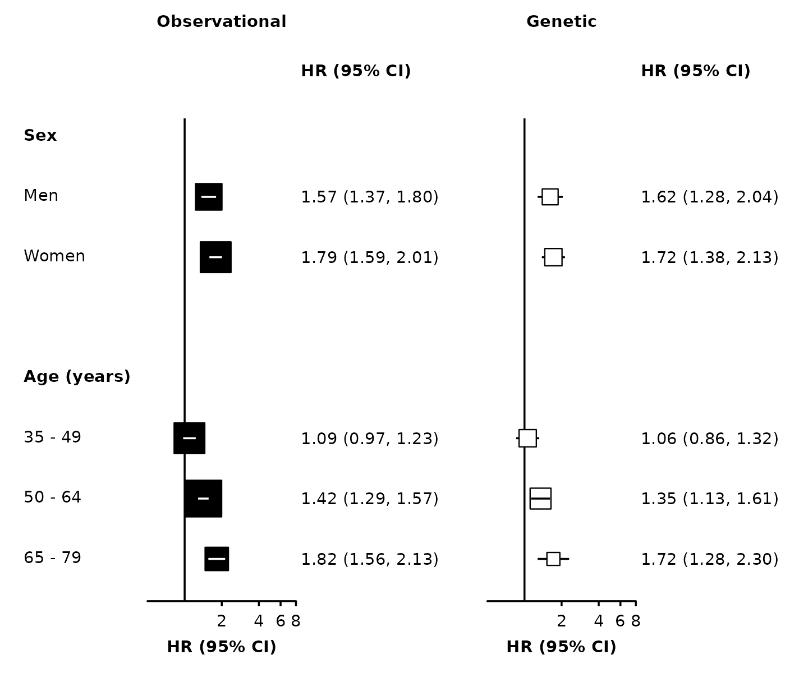

# Forest plots

## Introduction

The
[`forest_plot()`](https://neilstats.github.io/ckbplotr/reference/forest_plot.md)
function creates a forest plot using the
[ggplot2](https://ggplot2.tidyverse.org/) graphics package. The function
returns both a plot and the ggplot2 code used to create the plot. In
RStudio, the code used to create the plot will be shown in the Viewer
pane.

## Basic usage

Supply a data frame of estimates (by default, assumed to be log hazard
ratios) and standard errors to the
[`forest_plot()`](https://neilstats.github.io/ckbplotr/reference/forest_plot.md)
function:

``` r
my_results <- data.frame(
  subgroup   = c("men", "women", "35_49", "50_64", "65_79"),
  est        = c( 0.45,    0.58,    0.09,    0.35,     0.6),
  se         = c( 0.07,    0.06,    0.06,    0.05,    0.08)
)

forest_plot(my_results)
```

 Use `col.est`
and `col.stderr` to set the columns that contain estimates and standard
errors. By default, the function will look for columns with names
estimate/est/beta/loghr and stderr/std.error/std.err/se. If you want to
supply confidence interval limits, set `col.lci` and `col.uci`.

If your estimates are not on the log scale, then set
`exponentiate=FALSE`.

## Row labels

Set `col.key` to identify the rows of the forest plot.

``` r
forest_plot(my_results, col.key = "subgroup")
```


To add row labels, create a data frame with your row labels and one
column that matches the `col.key` column.

``` r
my_row_labels <- data.frame(
  subgroup = c("men", "women", "35_49", "50_64", "65_79"),
  label    = c("Men", "Women", "35 - 49", "50 - 64", "65 - 79")
)

forest_plot(my_results,
            col.key    = "subgroup",
            row.labels = my_row_labels)
```


To quickly add subheadings, include labels with a missing col.key:

``` r
row_labels <- data.frame(
  subgroup = c(NA, "men", "women",
               NA, "35_49", "50_64", "65_79"),
  label    = c("Sex", "Men", "Women",
               "Age (years)", "35 - 49", "50 - 64", "65 - 79")
)

forest_plot(my_results,
            col.key    = "subgroup",
            row.labels = row_labels)
```


To automatically create groupings and add subheadings, use multiple
columns in the `row.labels` data frame.

``` r
row_labels <- data.frame(
  subgroup = c("men", "women",
               "35_49", "50_64", "65_79"),
  group    = c("Sex", "Sex",
               "Age (years)", "Age (years)", "Age (years)"),
  label    = c("Men", "Women",
               "35 - 49", "50 - 64", "65 - 79")
)

forest_plot(my_results,
            col.key = "subgroup",
            row.labels = row_labels)
```


Use the `row.labels.levels` argument to choose columns for row labels
and the hierarchy for grouping. (Otherwise, all character columns in the
row labels data frame will be used.)

``` r
forest_plot(my_results,
            col.key           = "subgroup",
            row.labels        = row_labels,
            row.labels.levels = c("label"))
```


The order of rows is set by the `row.labels` data frame.

``` r
row_labels <- data.frame(
  subgroup = c("women", "men",
               "65_79", "50_64", "35_49"),
  group    = c("Sex", "Sex",
               "Age (years)", "Age (years)", "Age (years)"),
  label    = c("Women", "Men",
               "65 - 79", "50 - 64", "35 - 49")
)

forest_plot(my_results,
            col.key           = "subgroup",
            row.labels        = row_labels)
```


To exclude a subheading add “@nolabel” to the end.

``` r
row_labels <- data.frame(
  subgroup = c("men", "women",
               "35_49", "50_64", "65_79"),
  group    = c("Sex @nolabel", "Sex @nolabel",
               "Age (years)", "Age (years)", "Age (years)"),
  label    = c("Men", "Women",
               "35 - 49", "50 - 64", "65 - 79")
)

forest_plot(my_results,
            col.key           = "subgroup",
            row.labels        = row_labels)
```


Add a heading above the row labels with `row.labels.heading`:

``` r
row_labels <- data.frame(
  subgroup = c("men", "women",
               "35_49", "50_64", "65_79"),
  group    = c("Sex", "Sex",
               "Age (years)", "Age (years)", "Age (years)"),
  label    = c("Men", "Women",
               "35 - 49", "50 - 64", "65 - 79")
)

forest_plot(my_results,
            col.key            = "subgroup",
            row.labels         = row_labels,
            row.labels.heading = "Subgroup")
```


## Multiple panels

``` r
my_resultsA <- my_results

my_resultsB <- data.frame(
  subgroup   = c("men", "women", "35_49", "50_64", "65_79"),
  est        = c(0.48, 0.54, 0.06, 0.3, 0.54),
  se         = c(0.12, 0.11, 0.11, 0.09, 0.15)
)

forest_plot(list("Observational" = my_resultsA,
                 "Genetic"       = my_resultsB),
            col.key    = "subgroup",
            row.labels = row_labels)
```


You can use [`split()`](https://rdrr.io/r/base/split.html) to create a
list of data frames from a single data frame:

``` r
my_resultsAB <- data.frame(
  analysis = factor(c(rep("Observational", 5), rep("Genetic", 5)),
                    levels = c("Observational", "Genetic")),
  subgroup = c("men", "women", "35_49", "50_64", "65_79",
               "men", "women", "35_49", "50_64", "65_79"),
  est      = c( 0.45, 0.58, 0.09, 0.35, 0.6,
                0.48, 0.54, 0.06, 0.3, 0.54),
  se        = c(0.07, 0.06, 0.06, 0.05, 0.08,
                0.12, 0.11, 0.11, 0.09, 0.15)
)

forest_plot(split(my_resultsAB, ~ analysis),
            col.key    = "subgroup",
            row.labels = row_labels)
```


## Adding columns of text

Use `col.left` and `col.right` to add columns of text either side of
each panel. Use `left.heading` and `right.heading` to customise the
column headings.

``` r
my_results$n <- c(834, 923, 587, 694, 476)

forest_plot(my_results,
            col.key      = "subgroup",
            row.labels   = row_labels,
            col.left     = "n",
            left.heading = "No. of events")
```

 Use
`left.hjust` and `right.hjust` to set the horizontal justification of
the columns (0 = left, 0.5 = center, 1 = right).

## Scaling point size

Set `scalepoints = TRUE` to have point size (area) proportional to the
inverse of the variance (SE²) of the estimate.

``` r
forest_plot(my_results,
            col.key     = "subgroup",
            row.labels  = row_labels,
            scalepoints = TRUE)
```

 To have
consistent scaling across plots, set `minse` to the same value (it must
be smaller than the smallest SE). This will ensure the same size scaling
is used across the plots.

## Confidence interval lines

Narrow confidence interval lines can be hidden by points. Set the
`panel.width` argument to change the appearance of narrow confidence
interval lines. The function will by default try to change the colour
and plotting order of confidence intervals so that they are not hidden.
You can also supply vectors and lists to the `cicolour` argument to have
more control.

Note that the calculations for identifying narrow confidence intervals
has has been designed to work for shapes 15/‘square’ (the default) and
22/‘square filled’, and for symmetric confidence intervals. These may
not be completely accurate in all scenarios, so check your final output
carefully.

``` r
forest_plot(split(my_resultsAB, ~ analysis),
            col.key     = "subgroup",
            row.labels  = row_labels,
            scalepoints = TRUE,
            pointsize   = 8,
            xlim        = c(0.5, 3),
            xticks      = c(0.5, 1, 2, 3),
            panel.width = unit(28, "mm"))
```


``` r
forest_plot(split(my_resultsAB, ~ analysis),
            col.key     = "subgroup",
            row.labels  = row_labels,
            scalepoints = TRUE,
            pointsize   = 10,
            xlim        = c(0.5, 8),
            
            shape       = "square filled",
            stroke      = 0.5,
            fill        = list("black", "white"),
            panel.width = unit(28, "mm"))
```



## Different limits on panels

[`forest_plot()`](https://neilstats.github.io/ckbplotr/reference/forest_plot.md)
uses ggplot facets to place forest plots side-by-side. Facets cannot
easily have different scales applied, but you can use
[`forest_plot()`](https://neilstats.github.io/ckbplotr/reference/forest_plot.md)
for each panel then arrange them side-by-side.

If `xlim`, `xticks` and `panels` are lists of the same length, then
[`forest_plot()`](https://neilstats.github.io/ckbplotr/reference/forest_plot.md)
will do this automatically. The function will return a list containing
“figure” (a graphic object of the whole figure) and “plots” (the result
of calls to
[`forest_plot()`](https://neilstats.github.io/ckbplotr/reference/forest_plot.md)
for each panel).

``` r
forest <- forest_plot(split(my_resultsAB, ~ analysis),
                      col.key = "subgroup",
                      row.labels = row_labels,
                      xlim = list(c(0.5, 3 + 1e-10),
                                  c(0.1, 4)),
                      xticks = list(c(0.5, 1, 2, 3),
                                    c(0.1, 1, 2, 4)),
                      xlab = c("Hazard Ratio (95% CI)", "Odds Ratio (95% CI)"),
                      right.heading = list("HR (95% CI)", "OR (95% CI)"))
grid::grid.newpage()
grid::grid.draw(forest$figure)
```


Use [`grid::grid.draw()`](https://rdrr.io/r/grid/grid.draw.html) to draw
the figure (use
[`grid::grid.newpage()`](https://rdrr.io/r/grid/grid.newpage.html) to
clear), and `ggsave()` or
[`save_figure()`](https://neilstats.github.io/ckbplotr/reference/save_figure.md)
to save to a file.

Warnings: If `scalepoints = TRUE` (and `minse` is not specified the same
for each plot) then this scaling will be on a panel-by-panel basis so
box sizes are not comparable between panels.

## Adding heterogeneity and trend test results

The `addtext` argument can be used to add results of heterogeneity or
trend tests, or some other text, in the text column of estimates and
CIs. It needs to be a list of data frames, the same length as panels.
Data frames should contain a column with the name specified in col.key,
and one or more of:

- a column named ‘text’ containing character strings
- a column named ‘expr’ containing character strings that will be parsed
  into expressions and displayed as described in ?plotmath
- columns named ‘het_dof’, ‘het_stat’, and ‘het_p’ containing character
  strings
- columns names ‘trend_stat’ and ‘trend_p’ containing character strings

``` r
het_trend_results <- data.frame(
 analysis   = factor(c("Observational", "Observational", "Observational", "Genetic", "Genetic", "Genetic"),
 levels     = c("Observational", "Genetic")),
 subgroup   = c( "men", "35_49", "35_49", "men", "35_49", "35_49"),
 het_dof    = c( "1", NA, NA, "1", NA, NA),
 het_stat   = c( "1.99", NA, NA, "0.136", NA, NA),
 het_p      = c("=0.16", NA, NA, "=0.71", NA, NA),
 trend_stat = c( NA, "27.2", NA, NA, "6.98", NA),
 trend_p    = c( NA, "<0.001", NA, NA, "=0.008", NA),
 text       = c( NA, NA, NA, NA, NA, "Note"),
 expr       = c(NA, NA, "frac(-b %+-% sqrt(b^2 - 4*a*c), 2*a)", NA, NA, NA)
)
```

``` r
forest_plot(split(my_resultsAB, ~ analysis),
            col.key     = "subgroup",
            row.labels  = row_labels,
            scalepoints = TRUE,
            pointsize   = 8,
            xlim        = c(0.5, 3),
            xticks      = c(0.5, 1, 2, 3),
            panel.width = unit(28, "mm"),
            right.space = unit(45, "mm"),
            addtext     = split(het_trend_results, ~ analysis))
```


Note that values should all be character strings, and P-values should
include the necessary “=” or “\<”.

The automatic positioning of columns and spacing of panels does not take
into account this additional text, so you may need to use the
`right.space` and `right.pos` arguments for a satisfactory layout.

## Customisation

See [Customising
plots](https://neilstats.github.io/ckbplotr/articles/customising_plots.md)
for more ways to customise forest plots.
