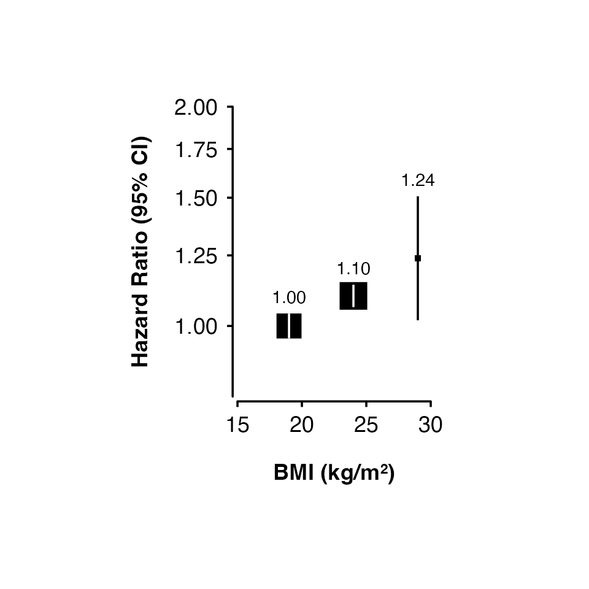

# Shape plots

## Introduction

The
[`shape_plot()`](https://neilstats.github.io/ckbplotr/reference/shape_plot.md)
function creates a plot of estimates and confidence intervals using the
[ggplot2](https://ggplot2.tidyverse.org/) graphics package. The function
returns both a plot and the ggplot2 code used to create the plot. In
RStudio, the code used to create the plot will be shown in the Viewer
pane (see \[Plot code example\] for an example).

## Basic usage

Supply a data frame of estimates and standard errors to the
[`shape_plot()`](https://neilstats.github.io/ckbplotr/reference/shape_plot.md)
function and specify the name of the column that contains x-axis values
using `col.x`. Use `col.estimate` and `col.stderr` to specify the names
of columns containing estimates and standard errors (some common names
are found automatically).

``` r
my_results <- data.frame(
  risk_factor = c(  17,    20,  23.5,    25,    29),
  est         = c(   0, 0.069, 0.095, 0.182, 0.214),
  se          = c(0.05, 0.048, 0.045, 0.045, 0.081)
)

shape_plot(my_results,
           col.x = "risk_factor")
```


If your estimates and standard errors are on the log scale (e.g. log
hazard ratios), then set `exponentiate` to true. This will plot
exp(estimates) and use a log scale for the axis.

``` r
shape_plot(my_results,
           col.x        = "risk_factor",
           exponentiate = TRUE)
```


Set axis limits using `xlims` and `ylims`, and axis titles using `xlab`
and `ylab`.

``` r
shape_plot(my_results,
           col.x        = "risk_factor",
           xlims        = c(15, 30),
           ylims        = c(0.8, 1.6),
           exponentiate = TRUE,
           xlab         = "BMI (kg/m\u00B2)",
           ylab         = "Hazard Ratio (95% CI)")
```


Setting `ylims` will also make the function add code to show arrows
where confidence interval lines exceed the limits.

``` r
shape_plot(my_results,
           col.x        = "risk_factor",
           xlims        = c(15, 30),
           ylims        = c(0.95, 1.4),
           exponentiate = TRUE,
           xlab         = "BMI (kg/m\u00B2)",
           ylab         = "Hazard Ratio (95% CI)")
```


## Using groups

Use `col.group` to plot results for different groups (using shades of
grey for the fill colour).

``` r
my_results <- data.frame(
  risk_factor = c(17, 20, 23.5, 25, 29,
                  18, 20.5, 22.7, 24.5, 30),
  est         = c(0, 0.069, 0.095, 0.182, 0.214,
                  0.32, 0.369, 0.395, 0.482, 0.514),
  se          = c(0.05, 0.048, 0.045, 0.045, 0.061,
                  0.04, 0.049, 0.045, 0.042, 0.063),
  group       = factor(rep(c("Women", "Men"), each = 5))
)

shape_plot(my_results,
           col.x        = "risk_factor",
           xlims        = c(15, 30),
           ylims        = c(0.8, 2),
           exponentiate = TRUE,
           xlab         = "BMI (kg/m\u00B2)",
           ylab         = "Hazard Ratio (95% CI)",
           col.group    = "group",
           ciunder      = TRUE)
```


## Adding lines

Use `lines` to add lines for each group:

1.  “lmw” = Linear fit through estimates, weighted by inverse variance.
2.  “lm” = Unweighted linear fit through estimates.
3.  “connect” = Lines connecting each estimate.

``` r
shape_plot(my_results,
           col.x        = "risk_factor",
           xlims        = c(15, 30),
           ylims        = c(0.8, 2),
           exponentiate = TRUE,
           xlab         = "BMI (kg/m\u00B2)",
           ylab         = "Hazard Ratio (95% CI)",
           col.group    = "group",
           ciunder      = TRUE,
           lines        = "lmw")
```


## Categorical risk factor

The risk factor can be a factor. You may need to add position arguments
so that points, intervals and text do not overlap.

``` r
smoking_results <- data.frame(
  smk_cat = factor(c("Never", "Ex", "Current"),
                   levels = c("Never", "Ex", "Current")),
  est         = c(0, 0.362, 0.814),
  se          = c(0.05, 0.09, 0.041)
)

shape_plot(smoking_results,
           col.x        = "smk_cat",
           ylims        = c(0.5, 4),
           ybreaks      = c(0.5, 1, 2, 4), 
           xlab         = "Smoking",
           ylab         = "Hazard Ratio (95% CI)",
           exponentiate = TRUE)
```


## Scaling point size

Set `scalepoints = TRUE` to have point size (area) proportional to the
inverse of the variance (SE²) of the estimate.

``` r
my_results <- data.frame(
  risk_factor = c(19, 24, 29),
  est         = c(0, 0.095, 0.214),
  se          = c(0.02, 0.018, 0.1)
)

shape_plot(my_results,
           col.x        = "risk_factor",
           xlims        = c(15, 30),
           ylims        = c(0.8, 2),
           exponentiate = TRUE,
           xlab         = "BMI (kg/m\u00B2)",
           ylab         = "Hazard Ratio (95% CI)",
           scalepoints  = TRUE)
```

 To have
consistent scaling across plots, set `minse` to the same value (it must
be smaller than the smallest SE). This will ensure the same size scaling
is used across the plots.

## Confidence intervals

Narrow confidence interval lines can be hidden by points. Set the
`height` argument to change the appearance of short confidence interval
lines. The function will by default try to change the colour and
plotting order of confidence intervals so that they are not hidden. You
can also supply vectors and lists to the `cicolour` argument to have
more control.

Note that the calculations for identifying narrow confidence intervals
has has been designed to work for shapes 15/‘square’ (the default) and
22/‘square filled’, and for symmetric confidence intervals. These may
not be completely accurate in all scenarios, so check your final output
carefully.

``` r
my_results <- data.frame(
  risk_factor = c(19, 24, 29),
  est         = c(0, 0.095, 0.214),
  se          = c(0.02, 0.018, 0.1)
)

shape_plot(my_results,
           col.x        = "risk_factor",
           xlims        = c(15, 30),
           ylims        = c(0.8, 2),
           exponentiate = TRUE,
           xlab         = "BMI (kg/m\u00B2)",
           ylab         = "Hazard Ratio (95% CI)",
           scalepoints  = TRUE,
           pointsize    = 6,
           height       = unit(5, "cm"))
```



## Customisation

See [Customising
plots](https://neilstats.github.io/ckbplotr/articles/customising_plots.md)
for more ways to customise shape plots.
